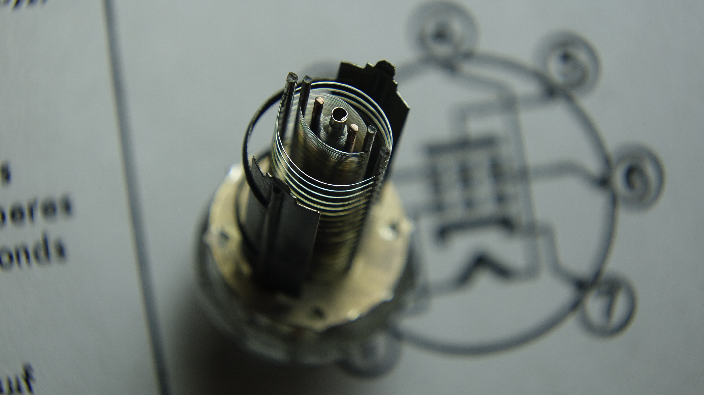
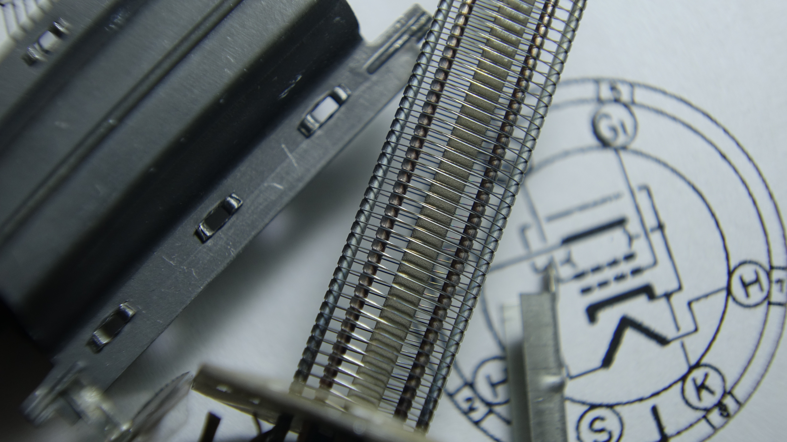

# Interactive Pentode Simulation (Blender) — 6AU6

The follow-on to [Blender-Triode-6SN7](https://github.com/holla2040/Blender-Triode-6SN7):
a physically-motivated teaching model of a **pentode**, with the screen grid,
suppressor grid, secondary emission, and a **tetrode-mode toggle** so students
can see the kink the suppressor was invented to fix. Geometry is a stylized
6AU6 miniature (7-pin) with electrode gaps exaggerated ~3× for visibility.

*The real thing, top-down: cathode tube in the middle, fine control grid,
screen grid, the coarse open suppressor spiral, and the flattened plate
halves. This photo set the model's geometry.*

*Grid winding on its side rails, with the dimpled plate behind.*

## Files

- `pentode_sim.blend` — ready to open (script also embedded as a text block)
- `pentode_sim.py`    — standalone builder: `blender -P pentode_sim.py`
  rebuilds the whole scene from nothing
- `shots/`            — rendered stills of the key operating points
- `img/`              — macro photos of the real 6AU6 the model is based on
- `PROMPT.md`         — the original request, verbatim
- `PLAN.md`           — the implementation plan as approved

## Run it

1. Open `pentode_sim.blend`.
2. The electron engine is a Python frame handler, which Blender does not
   persist: open the **Text Editor**, select `pentode_sim.py`, press
   **Run Script** once (or launch with `blender -P pentode_sim.py`).
3. In the 3D view press **N** → **Pentode** tab.
4. Press **Run / Pause**, then drag sliders while it plays.

## Controls (Pentode tab)

| Control | Range | What it teaches |
|---|---|---|
| Heater temp | 300–1300 K | Thermionic emission is exponential in T; below ~700 K the tube is dead no matter the voltages. |
| Grid 1 voltage | −20…+10 V | The control grid: a few negative volts throttle the whole current; ≈ −8 V cuts off. Positive draws g1 current. |
| **Screen voltage** | 0–200 V | **The screen does the pulling.** At Vg2 = 0 even a 300 V plate moves nothing; raising Vg2 sets the current. |
| Plate voltage | 0–300 V | Above the knee (~40 V) Ip is nearly FLAT — the screen isolates the cathode from the plate. Below it, electrons stall behind the suppressor and fall back to the screen: Ip drops, Ig2 spikes. |
| Suppressor connected | on/off | **Uncheck for tetrode mode**: secondary electrons (orange) knocked off the plate escape to the screen whenever Vp < Vg2 — Ip sags ~60%, Ig2 jumps (the tetrode kink). Re-check and the suppressor's field shoves them back. |
| Top / Inside / Overview | — | Top = cross-section down the axis (cathode, 3 grid rings, flattened plate). Inside = standing in the suppressor–plate gap. Free-fly with walk mode (`Shift+\``). |

Meters: in-scene glowing text + panel rows for **Ip (plate)** and **Ig2
(screen)** currents, the space-charge cloud population, and g1 interception.

## Six experiments for students

1. **Cold tube**: T = 500 K → nothing, at any voltages.
2. **Screen off**: Vg2 = 0, Vp = 300 → still nothing. The plate can't reach
   the cathode; the screen is the accelerator.
3. **Nominal**: Vg2 = 150, Vp = 250 → strong flow; note Ig2 ≈ ¼–⅓ of Ip (capture calibrated to the datasheet's Ic2 curves)
   (electrons caught by screen wires sparkle on the silver helix).
4. **Pentode flatness**: drag Vp from 250 down to 80 → Ip barely moves.
   That's the screen isolating the cathode — and why a pentode makes a good
   constant-current amplifier.
5. **The knee**: keep going below ~40 V → electrons stall behind the
   suppressor and return to the screen: Ip collapses, Ig2 spikes.
6. **The tetrode kink**: set Vp = 60, uncheck *Suppressor connected* →
   orange secondaries stream backward from plate to screen and Ip sags.
   Re-check it → the stream collapses back onto the plate. That's why the
   pentode has five electrodes.

## Physics model (honest summary)

Same engine as the triode project: cylindrical-radial region fields, a local
1/d² term per grid wire (with per-grid strength and capture radius),
Richardson-style emission `∝ exp(−13000·(1/T − 1/1100))`, mean-field space
charge throttling emission, explicit-Euler integration (1/24 s frames,
4 substeps, 7000-electron pool) in a `frame_change_pre` handler with numpy.

Pentode-specific: effective cathode field `Vg1 + Vg2/18 + Vp/400` (the plate
term is 20× weaker than the screen's — that ratio IS the pentode), a
retarding valley between screen and suppressor whose depth follows
`1.2·min(Vp, 60) − Vg2` (plate reach saturates above the saddle → flat top
with a knee), and Monte-Carlo secondary emission at the plate (yield 0.55
above an impact-speed threshold) with secondaries as a separate orange
particle bank. In tetrode mode the suppressor is removed from the circuit and
the g2→plate field `∝ (Vp − Vg2)` sweeps those secondaries into the screen.

Notes: the sim is stateful — timeline scrubbing doesn't rewind it; use Reset.
If you drive Blender over MCP while playback runs, expect a little extra
latency.
